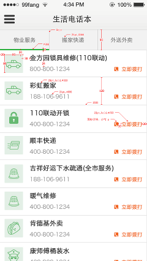

Installation
============

Getting the code
----------------

the recommended way to install the app is via pip_ install from github_::

    $ pip install -e git+https://github.com/yijingping/django-phonebook.git#egg=django-phonebook

.. _pip: http://www.pip-installer.org/
.. _github: http://www.github.com/

another way is cloning the project from github, then copy the `django-phonebook/phonebook` directory to your django project as an application.

Setup
-----

1. Add "phonebook" to your INSTALLED_APPS setting like this::

    INSTALLED_APPS = (
        ...
        'phonebook',
    )

2. Include the phonebook URLconf in your project urls.py like this::

    url(r'^phonebook/', include('phonebook.urls')),

3. Run `python manage.py migrate` to create the phonebook models.

4. Start the development server and visit http://127.0.0.1:8000/admin/
   to create phone category and phonebook(you'll need the Admin app enabled).

5. Visit http://127.0.0.1:8000/phonebook/?category=1&start=0&rows=20 to get the phonebook data::

    {
    ret: 0
    count: 15,
    total: 15,
    data: [
        {
        phone: "010-57123459",
        name: "金方园锁具(全市110联动)",
        small_category: 4
        },
        {
        phone: "4000000811",
        name: "速捷胜华锁具(全市110联动)",
        small_category: 4
        },
        {
        phone: "010-80639683",
        name: "亿家开锁(全市110联动)",
        small_category: 4
        },
        ...
    ],
    }

On mobile, it should look like this:

